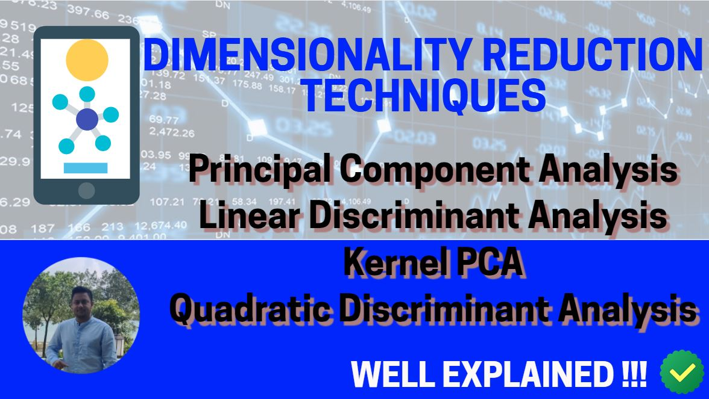

# DIMENSIONALITY REDUCTION TECHNIQUES - MACHINE LEARNING

Complete Guide on various Feature Extraction Techniques

## Playlist link: 
https://www.youtube.com/watch?v=gnFh__0Rw70&list=PLymcv5WXEpKjnWi7PMp2nul74TVXJ8q3E

Here’s a list of topics covered in this playlist/tutorial:

1. Principal Component Analysis (PCA)
2. Linear Discriminant Analysis (LDA)
3. Kernel PCA
4. Quadractic Discriminant Analysis (QDA)

Keep following my videos to get quality content on Python, Statistics, Machine Learning, Deep Learning, Data Science, AI & various other related topics.

